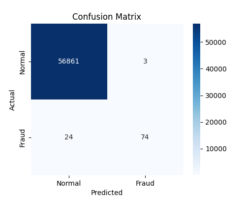
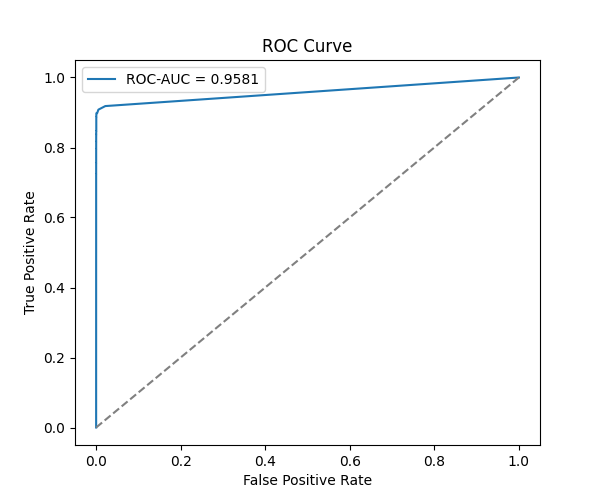
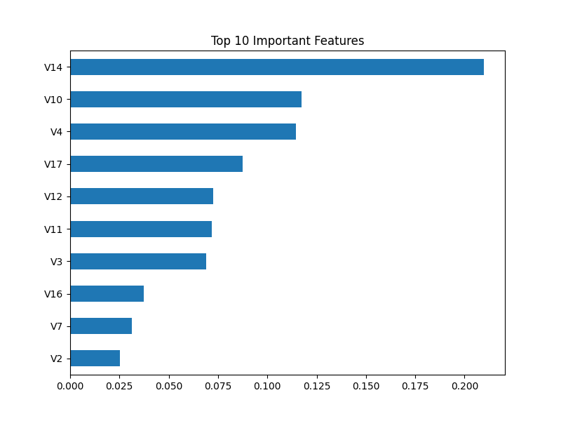

# Credit Card Fraud Detection

## 📌 Problem Statement
Credit card companies need to detect fraudulent transactions quickly to protect customers.
This project builds a machine learning model that classifies transactions as **fraudulent** or **legitimate**, handling a highly imbalanced real-world dataset (fraud makes up only ~0.17% of transactions).

## 📊 Dataset
- **Source:** [Kaggle - Credit Card Fraud Detection](https://www.kaggle.com/datasets/mlg-ulb/creditcardfraud)
- 284,807 transactions, 492 labeled as fraud
- Features `V1`-`V28` are PCA-transformed for confidentiality; `Time` and `Amount` are raw
- Target: `Class` (0 = Normal, 1 = Fraud)

## 🛠️ Tools & Libraries
- Python, Pandas, NumPy
- Matplotlib, Seaborn (visualization)
- Scikit-learn (Random Forest Classifier)

## 🔍 Approach
1. Loaded and explored the dataset (checked class imbalance, missing values)
2. Scaled `Amount` and `Time` features using `StandardScaler`
3. Split data into train/test sets with stratified sampling to preserve fraud ratio
4. Trained a **Random Forest Classifier** with `class_weight='balanced'` to handle the severe class imbalance
5. Evaluated using Confusion Matrix, Classification Report, and ROC-AUC (accuracy alone is misleading on imbalanced data)

## 📈 Results
| Metric | Score |
|---|---|
| ROC-AUC | 0.9581 |
| Precision (Fraud) | 0.96 |
| Recall (Fraud) | 0.76 |
| F1-score (Fraud) | 0.85 |

**Confusion Matrix:** Out of 98 actual fraud transactions in the test set, the model correctly caught 74 (recall 76%), with only 3 false alarms out of 56,864 normal transactions (precision 96%).

### Confusion Matrix


### ROC Curve


### Top Important Features


## 💡 Key Insights
- The model achieves a strong ROC-AUC of 0.9581, showing it separates fraud from normal transactions well despite the dataset being extremely imbalanced (only 0.17% fraud).
- High precision (0.96) means very few false alarms — only 3 legitimate transactions were incorrectly flagged as fraud.
- Recall (0.76) shows room for improvement — 24 out of 98 fraud cases were missed, which matters in a real fraud-detection system where missed fraud is costly.
- `V14`, `V10`, `V4`, and `V17` were the most important features driving fraud predictions.

## 🚀 How to Run
```bash
pip install -r requirements.txt
python credit_card_fraud_detection.py
```

## 📁 Repo Structure
```
credit-card-fraud-detection/
├── credit_card_fraud_detection.py
├── README.md
├── requirements.txt
├── confusion_matrix.png
├── roc_curve.png
├── feature_importance.png
└── class_distribution.png
```

---
*Built by [Adarsh](https://github.com/adarsh8158)*

